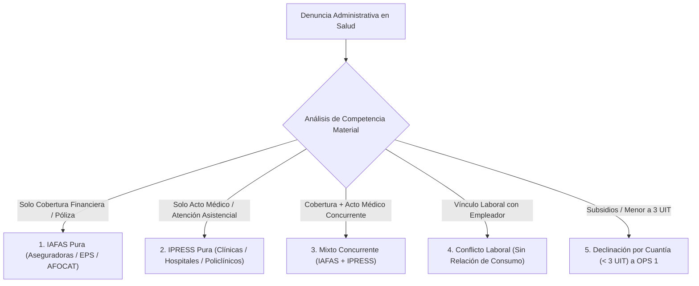
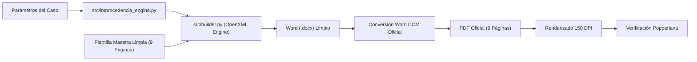

# ⚖️ Sistema Automatizado de Resoluciones de Improcedencia a SUSALUD
### Comisión de Protección al Consumidor N° 1 (CC1) — INDECOPI

[](https://www.python.org/)
[](LICENSE)
[](https://github.com/zero-phoenix/elaboracion-de-resoluciones-de-improcedencia-a-susalud/actions)
[](#arquitectura-tecnol%C3%B3gica-y-metodolog%C3%ADa-popperiana)
[](https://github.com/zero-phoenix/elaboracion-de-resoluciones-de-improcedencia-a-susalud/releases)

Repositorio institucional de alta precisión legaltech para la calificación jurídica, subsunción normativa y generación determinista en formato Word (`.docx`) y PDF de **Resoluciones Finales de Improcedencia por Incompetencia Material a favor de la Superintendencia Nacional de Salud (SUSALUD)**, emitidas exclusivamente por el **Órgano Colegiado de la Comisión de Protección al Consumidor N° 1 (CC1)** del Indecopi.

---

## 📑 Tabla de Contenidos
1. [Resumen Ejecutivo y Propósito](#-resumen-ejecutivo-y-propósito)
2. [Marco Normativo y Delimitación de Competencias (SUSALUD vs. INDECOPI)](#-marco-normativo-y-delimitación-de-competencias-susalud-vs-indecopi)
3. [Diferencia Estructural: Secretaría Técnica vs. Colegiado de Comisión](#-diferencia-estructural-secretaría-técnica-vs-colegiado-de-comisión)
4. [Los 5 Supuestos Universales de Improcedencia a SUSALUD](#-los-5-supuestos-universales-de-improcedencia-a-susalud)
5. [Directiva N° 001-2021-COD-INDECOPI y Devolución de Tasas](#-directiva-n-001-2021-cod-indecopi-y-devolución-de-tasas)
6. [Arquitectura Tecnológica y Metodología Popperiana](#-arquitectura-tecnológica-y-metodología-popperiana)
7. [Estructura del Proyecto](#-estructura-del-proyecto)
8. [Guía de Instalación y Uso](#-guía-de-instalación-y-uso)
9. [Pipeline de Integración y Entrega Continua (CI/CD)](#-pipeline-de-integración-y-entrega-continua-cicd)
10. [Caso Demostrativo Complejo Generado](#-caso-demostrativo-complejo-generado)

---

## 🎯 Resumen Ejecutivo y Propósito

En los procedimientos administrativos sancionadores en materia de protección al consumidor, una gran cantidad de denuncias interpuestas ante la Comisión de Protección al Consumidor N° 1 versan sobre prestaciones asistenciales de salud humana o coberturas de aseguramiento médico.

Conforme al marco legal vigente en el Perú, el Estado ha conferido competencia administrativa exclusiva y especializada a la **Superintendencia Nacional de Salud (SUSALUD)** para supervisar, fiscalizar y sancionar las conductas de las Instituciones Prestadoras de Servicios de Salud (**IPRESS**) y de las Instituciones Administradoras de Fondos de Aseguramiento en Salud (**IAFAS**).

Este sistema elimina la discrecionalidad errática y los defectos formales en la redacción de resoluciones, automatizando:
- La subsunción de hechos y pretensiones bajo la tipificación del Reglamento de Infracciones y Sanciones de SUSALUD (D.S. N° 031-2014-SA).
- El ensamblaje de documentos Word (`.docx`) limpios que preservan **100% de las notas al pie legales** de OpenXML.
- La aplicación exacta de la tipografía institucional (negrita únicamente en ordinales del *RESUELVE*).
- El cumplimiento de la regla de devolución de la tasa de tramitación (Art. 13.1 Directiva N° 001-2021-COD-INDECOPI).

---

## 🏛️ Marco Normativo y Delimitación de Competencias (SUSALUD vs. INDECOPI)

### 1. Marco Jurídico Especial de SUSALUD:
- **Decreto Legislativo N° 1158** (Modernización y Fortalecimiento de SUSALUD) y su modificatoria por **Decreto Legislativo N° 1289**:
  - *Artículo 6:* Competencia exclusiva de SUSALUD sobre IAFAS y fondos de aseguramiento.
  - *Artículo 7:* Competencia exclusiva de SUSALUD sobre IPRESS y calidad del acto médico.
  - *Artículo 8:* Potestad sancionadora en el ámbito nacional sobre aseguramiento y prestaciones.
- **Ley N° 26842** (Ley General de Salud):
  - *Artículo 15:* Derechos de los usuarios a ser atendidos con pleno respeto a su dignidad, recibir información sobre su tratamiento y contar con copia completa de su historia clínica.
- **Ley N° 29344** (Ley Marco de Aseguramiento Universal en Salud):
  - Regula las garantías de oportunidad, calidad y cobertura financiera de los planes de salud.
- **Decreto Supremo N° 031-2014-SA** (Reglamento de Infracciones y Sanciones de SUSALUD):
  - *Anexo I-B:* Catálogo de infracciones aplicables a **IPRESS** (falta de consentimiento informado, retención de historia clínica, cobros no presupuestados, falta de atención oportuna en emergencias).
  - *Anexo I-C:* Catálogo de infracciones aplicables a **IAFAS** (negativa injustificada de cobertura, dilación de cartas de garantía, cobro indebido de copagos o deducibles, falta de entrega de pólizas o planes).
- **Decreto Supremo N° 026-2015-SA** (Reglamento de Reclamos y Denuncias de Usuarios de Salud).

---

## ⚖️ Diferencia Estructural: Secretaría Técnica vs. Colegiado de Comisión

Una de las premisas fundamentales del Derecho Administrativo del Indecopi reside en la separación orgánica de funciones:

| Tipo de Acto Administrativo | Órgano Competente | Base Legal | Suscribe |
|---|---|---|---|
| **Resolución de Trámite / Admisibilidad** | Secretaría Técnica de la Comisión | Art. 21 y 24 Directiva 001-2021-COD-INDECOPI | Secretario Técnico |
| **Requerimiento de Subsanación / Inadmisibilidad** | Secretaría Técnica de la Comisión | TUO de la LPAG (Ley 27444) | Secretario Técnico |
| **Resolución de Improcedencia (Incompetencia Material)** | **Comisión de Protección al Consumidor N° 1 (Órgano Colegiado)** | Art. 38 D. Leg. 807; TUO de la LPAG | **Presidente de la Comisión y Comisionados Integrantes** |

> [!IMPORTANT]
> Las Resoluciones de Improcedencia a favor de SUSALUD son **actos administrativos decisorios** que concluyen la instancia respecto de las pretensiones incompetentes. En consecuencia, **NO son emitidas ni suscritas por la Secretaría Técnica**, sino que son deliberadas y suscritas por el Colegiado de la Comisión (CC1) bajo la presidencia de la Dra. Mónica Tatiana Siverio Puycan.

---

## 🔬 Los 5 Supuestos Universales de Improcedencia a SUSALUD

El sistema soporta cinco tipologías universales identificadas en los precedentes de la CC1:



### 1. IAFAS Pura:
- **Entidades:** Rímac Seguros, Pacífico Seguros, Mapfre, La Positiva, Sanitas EPS, AFOCATs.
- **Infracciones:** Negativa de cobertura, rechazo de carta de garantía por presunta preexistencia, débito indebido de primas, demora en reembolso.
- **Subsunción:** Art. 6 D. Leg. 1158 y Anexo I-C del D.S. 031-2014-SA.

### 2. IPRESS Pura:
- **Entidades:** Clínica Ricardo Palma, Clínica San Pablo, Clínica Internacional, Clínica Anglo Americana, Hospitales EsSalud / MINSA.
- **Infracciones:** Deficiencia en atención médica quirúrgica, cobros no informados, retraso en triaje de emergencias, retención o negativa a expedir copia fedateada de la historia clínica.
- **Subsunción:** Art. 7 D. Leg. 1158, Ley 26842 y Anexo I-B del D.S. 031-2014-SA.

### 3. Mixto Concurrente (IAFAS + IPRESS):
- **Entidades:** Aseguradora e Institución Prestadora demandadas conjuntamente.
- **Infracciones:** Negativa de cobertura de prótesis o medicamento en internamiento hospitalario, facturación clínica no cubierta y retención de alta hospitalaria.
- **Subsunción:** Aplicación coordinada de Anexos I-B e I-C del D.S. 031-2014-SA.

### 4. Falta de Relación de Consumo (Régimen Laboral / Empleador):
- **Hechos:** Denuncia dirigida contra el empleador por no haber registrado oportunamente al trabajador en la EPS corporativa o por descuentos de planilla.
- **Efecto:** Falta de legitimidad para obrar por inexistencia de relación de consumo con el empleador. Respecto a la IAFAS, incompetencia a SUSALUD.
- **Regla de Tasa:** No procede la devolución de la tasa de tramitación respecto al empleador debido a que existió calificación de fondo/legitimidad sobre dicho extremo.

### 5. Declinación por Cuantía (< 3 UIT) a OPS 1:
- **Hechos:** Reclamaciones patrimoniales exclusivas derivadas de accidentes de tránsito cubiertos por pólizas SOAT o CAT que no superan las 3 Unidades Impositivas Tributarias (UIT).
- **Destino:** Se declara improcedente ante CC1 y se remite al Órgano Resolutivo de Procedimientos Sumarísimos (OPS 1).

---

## 💰 Directiva N° 001-2021-COD-INDECOPI y Devolución de Tasas

El numeral 13.1 de la Directiva N° 001-2021-COD-INDECOPI establece:
> *"13.1. En los casos en que la Comisión declare la improcedencia de la denuncia por incompetencia material notoria, se ordenará la devolución del derecho de tramitación pagado por el denunciante, previa solicitud dirigida a la Unidad de Finanzas y Contabilidad del Indecopi."*

### Estructura Mandatoria en la Parte Resolutiva:
El artículo **PRIMERO** de la resolución debe contener taxativamente la orden de devolución:
```text
PRIMERO: declarar improcedente la denuncia interpuesta por [DENUNCIANTE] en contra de [DENUNCIADO(S)], y ordenar la devolución de la tasa cancelada por derecho de tramitación, ascendente a S/ 36,00 (treinta y seis con 00/100 Soles), previa solicitud a la Unidad de Finanzas y Contabilidad del Indecopi.
```

---

## 🛠️ Arquitectura Tecnológica y Metodología Popperiana

El motor del sistema fue construido bajo una estricta epistemología popperiana: **cada regla de estilo, espaciado y estructura fue refutada hasta alcanzar una correspondencia idéntica con los modelos oficiales aprobados**.



### Principios del Motor:
1. **Preservación Inviolable de OpenXML (`word/footnotes.xml`):**
   A diferencia de scripts convencionales de `python-docx` que borran y recrean párrafos (destruyendo los identificadores `<w:footnoteReference>`), el motor de este repositorio navega los `<w:r>` (runs) preservando intactos los 20 elementos de notas al pie legales originales.
2. **Microtipografía Calibrada (Negrita Ordinal vs. Regular Sustantivo):**
   En la sección `RESUELVE`:
   - El descriptor ordinal (`PRIMERO: `, `SEGUNDO: `, `TERCERO: `) posee `<w:b/>` activado.
   - El texto dispositivo sustantivo se mantiene forzosamente en fuente regular Arial 10 (`<w:b w:val="0"/>`).
   - Esto previene el ensanchamiento horizontal tipográfico, garantizando que el `PRIMERO:` y `SEGUNDO:` quepan holgadamente en la página 8 y que el `TERCERO:` comience con exactitud quirúrgica en la página 9.
3. **Guardia DLP (Data Loss Prevention):**
   Verifica que no subsista ningún placeholder no resuelto (`[DENUNCIANTE]`, `{EXPEDIENTE}`), comentario de Word (`<w:commentReference>`), ni texto resaltado (`<w:highlight>`).
4. **Header Dinámico:**
   Actualización automatizada del número de expediente en el encabezado de página vía reemplazo XML directo en `word/header1.xml`.

---

## 📁 Estructura del Proyecto

```text
elaboracion-de-resoluciones-de-improcedencia-a-susalud/
├── .github/
│   └── workflows/
│       └── build-and-release.yml         # Compilación con PyInstaller y release automático
├── config/
│   └── config.py                         # Rutas absolutas y relativas del sistema
├── generados/
│   ├── RESOLUCION_0842-2026_CC1_RIMAC_ANGLO.docx  # Word limpio del caso complejo
│   ├── RESOLUCION_0842-2026_CC1_RIMAC_ANGLO.pdf   # PDF oficial convertido vía Word COM
│   └── capturas_nueva_resolucion/        # Capturas HD de las 9 páginas completas
├── plantillas_maestras/
│   ├── plantilla_maestra_clean_9paginas.docx      # Plantilla oficial sin comentarios ni marcas
│   ├── plantilla_maestra_iafas.docx
│   ├── plantilla_maestra_ipress.docx
│   └── plantilla_maestra_mixta_iafas_ipress.docx
├── scripts/
│   ├── improcedencia.py                  # CLI principal unificado
│   ├── generar_caso_nuevo_rimac_anglo.py # Generador demostrativo de caso mixto
│   ├── render_nueva_resolucion.py        # Conversor Word COM y renderizador a PNG
│   ├── guardia_improcedencia.py          # Auditor DLP contra fugas
│   └── verificar_improcedencia.py        # Batería de comprobación popperiana
├── src/
│   ├── __init__.py
│   ├── builder.py                        # Motor OpenXML quirúrgico con preservación de notas
│   └── improcedencia_engine.py           # Motor de calificación y subsunción jurídica
├── requirements.txt                      # Dependencias Python
└── README.md                             # Documentación maestra del repositorio
```

---

## 💻 Guía de Instalación y Uso

### 1. Clonar el Repositorio:
```bash
git clone https://github.com/zero-phoenix/elaboracion-de-resoluciones-de-improcedencia-a-susalud.git
cd elaboracion-de-resoluciones-de-improcedencia-a-susalud
```

### 2. Configurar el Entorno Virtual:
```powershell
python -m venv venv
.\venv\Scripts\Activate.ps1
pip install -r requirements.txt
```

### 3. Generar una Resolución de Muestra (CLI):
```powershell
python scripts/improcedencia.py construir-muestra
```

### 4. Generar el Caso Ficticio Complejo (IAFAS + IPRESS):
```powershell
python scripts/generar_caso_nuevo_rimac_anglo.py
python scripts/render_nueva_resolucion.py
```

### 5. Auditar con la Guardia DLP:
```powershell
python scripts/improcedencia.py guardia "generados/RESOLUCION_0842-2026_CC1_RIMAC_ANGLO.docx"
```

---

## 🔄 Pipeline de Integración y Entrega Continua (CI/CD)

El repositorio cuenta con un pipeline automatizado mediante **GitHub Actions** en `.github/workflows/build-and-release.yml`:

1. **Compilación en Windows:** Al generar un tag de versión (`v*`), el runner `windows-latest` compila el motor con PyInstaller:
   ```powershell
   pyinstaller --name "improcedencia-susalud-engine" --onefile scripts/improcedencia.py
   ```
2. **Empaquetado Portátil:** Crea un paquete `.zip` con el ejecutable, las plantillas maestras limpias y la documentación.
3. **Publicación en Releases:** Mediante `softprops/action-gh-release@v2`, crea automáticamente un Release público con los archivos binarios disponibles para descarga directa:
   - `improcedencia-susalud-engine.exe` (Ejecutable portable Windows x64)
   - `improcedencia-susalud-windows-x64.zip` (Paquete completo de distribución)

---

## 📸 Caso Demostrativo Complejo Generado

### Datos del Procedimiento Simulado:
- **Expediente N°:** `0842-2026/CC1`
- **Denunciante:** Doña Rosa Elvira Mendoza Carrión
- **Denunciados:** **Rímac Seguros y Reaseguros S.A.** (IAFAS) y **Clínica Anglo Americana S.A.** (IPRESS)
- **Materia:** Improcedencia de la denuncia por incompetencia material (Susalud) y devolución de tasa.
- **Páginas Totales:** **9 páginas exactas**, cero comentarios, cero resaltados, 20 notas al pie preservadas.

### Inspección Visual de Páginas (Capturas de Alta Resolución):

| Pág. 1: Datos y Encabezado | Pág. 2: Antecedentes y Hechos | Pág. 3: Continuación de Hechos |
|:---:|:---:|:---:|
|  |  |  |

| Pág. 4: Medidas Correctivas | Pág. 5: Cuestión Previa y SUSALUD | Pág. 6: Subsunción D. Leg. 1158 |
|:---:|:---:|:---:|
|  |  |  |

| Pág. 7: Conclusión Incompetencia | Pág. 8: RESUELVE (PRIMERO y SEGUNDO) | Pág. 9: TERCERO y Firmas Colegiadas |
|:---:|:---:|:---:|
|  |  |  |

---

## ⚖️ Licencia y Responsabilidad

Este software ha sido diseñado con fines de investigación legaltech y soporte resolutivo en el ámbito de protección al consumidor peruano. Desarrollado respetando la normativa legal administrativa y las directivas institucionales del INDECOPI y SUSALUD.
